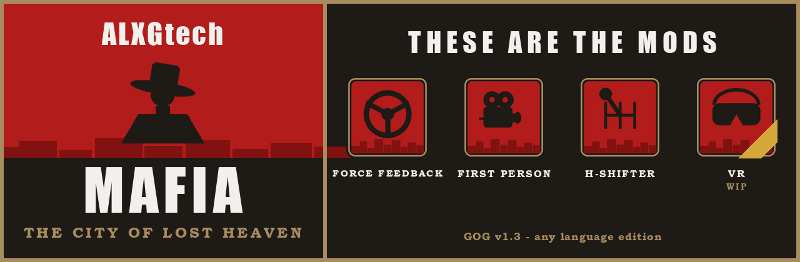
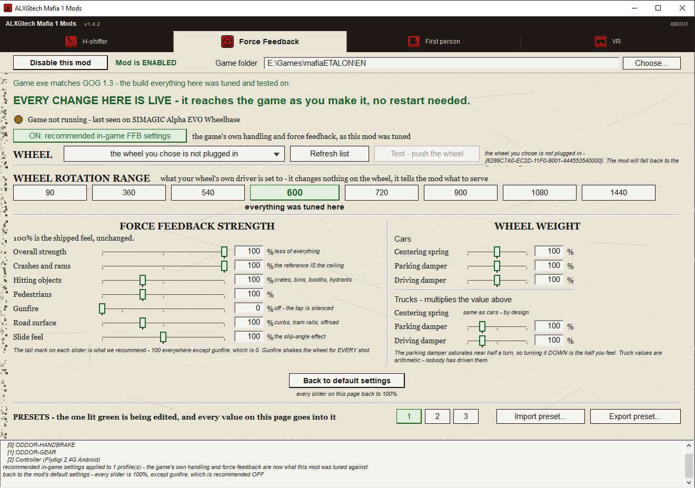
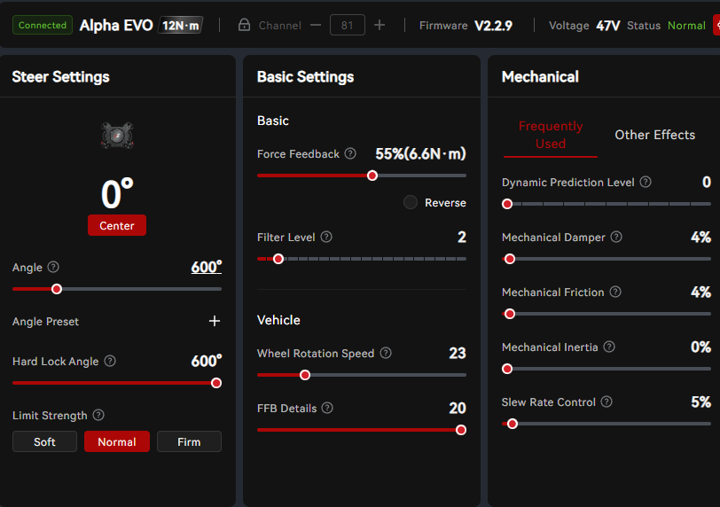
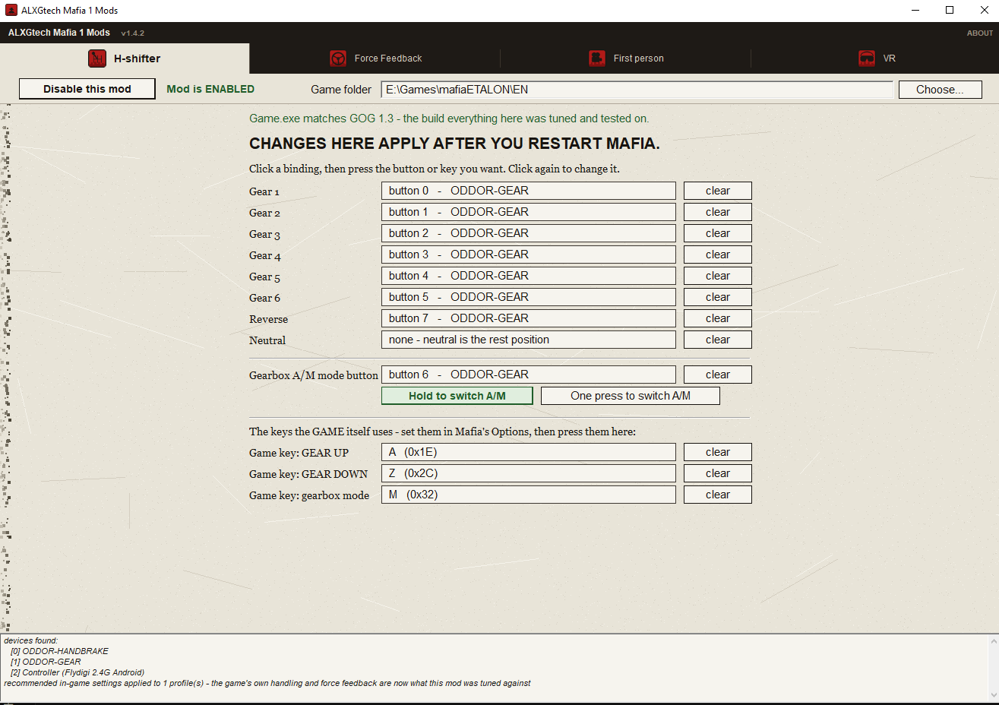
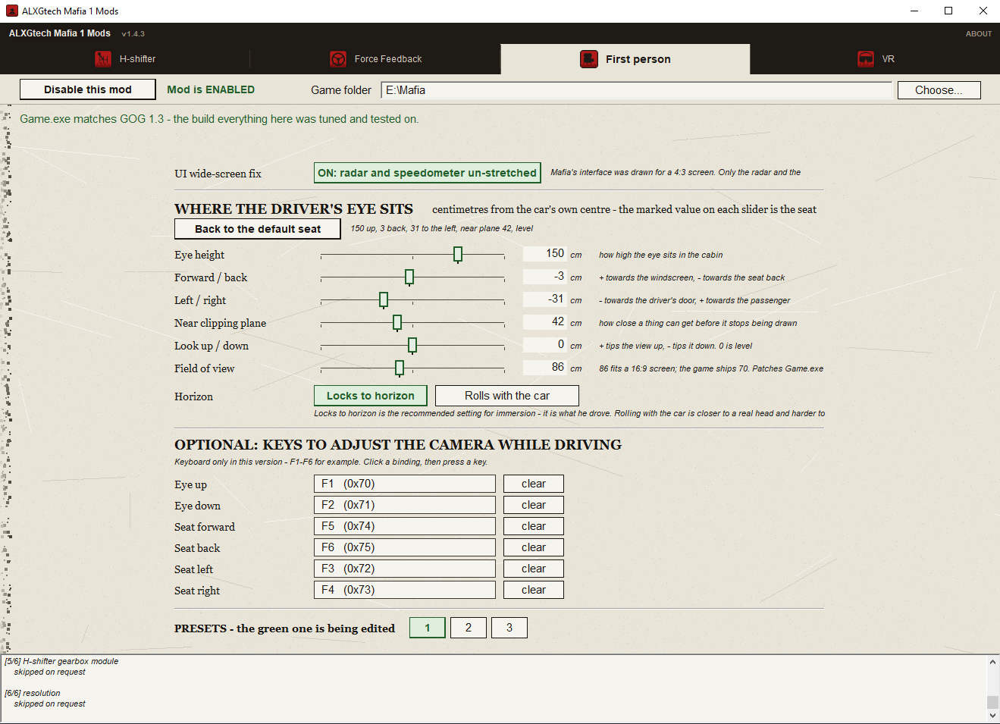

[English](README.md) | [Русский](README.ru.md) | Čeština | [Polski](README.pl.md)

# ALXGtech Mafia 1 Mods

Tento mod dává hře Mafia: The City of Lost Heaven (2002, **GOG v1.3 build 16073**)

* moderní podporu volantu se silovou zpětnou vazbou Direct Drive Force Feedback (testováno na Simagic EVO 12nm, fungovat by měla většina volantů),
* kameru z pohledu řidiče
* H-řadičku.

v jednom nástroji, který je nainstaluje i odinstaluje.

Mafia tak konečně jezdí jako pořádná simulace!

## 🚀 Rychlý start

Tři módy pro **Mafia: The City of Lost Heaven (2002)** - tu původní, první Mafii - v jednom malém programu.

> **Vytvořeno a otestováno pro vydání GOG, v1.3 build 16073 - jakákoli jazyková verze.** Všech osm
> jich obsahuje shodný `Game.exe`, takže poslouží kterákoli. **Vydání na Steamu ani žádná jiná
> verze či obchod testovány nebyly a kompatibilita s nimi není zaručena.** Program zkontroluje váš
> `Game.exe` a upozorní, pokud nejde o sestavení, pro které bylo vše vytvořeno.

Příliš dlouhé na čtení? To je všechno:

1. Stáhněte `.zip` ze sekce **[Releases](../../releases)**.
2. Rozbalte jej.
3. Zkopírujte `ALXGtech Mafia 1 Mods.exe` do složky s Mafií, vedle `Game.exe`.
4. Spusťte jej.
5. V programu zapněte módy, které chcete, a hrajte.

**Pak je nastavte - [je to na pět minut](#-nastavení-každého-módu).** Hlavně silovou zpětnou
vazbu: musíte jí říct rozsah otáčení vašeho volantu, jinak nebude působit správně.

| | mód | v tomto vydání |
|:--:|---|---|
| 🎮 | **Silová zpětná vazba** - kompletní sada sil pro direct drive volant | ✅ hotovo |
| 👁️ | **Kamera z pohledu řidiče** - místo řidiče a zorné pole odpovídající 16:9 | ✅ hotovo |
| 🕹️ | **H-řadička** - skutečná kulisa ovládá vlastní převody hry | ✅ hotovo |
| 🥽 | **VR** | 🚧 rozpracováno - záložka je v okně, zatím nic neinstaluje |

Vše níže jsou podrobnosti: co jednotlivé módy dělají, co zapisují do složky hry a jak je vrátit
zpět.

## Než začnete instalovat

- **Zazálohujte si uložené pozice.** Jsou v `<game>\savegame\`. Instalátor zaznamenává každý
  soubor, který zapíše, a umí vše vrátit zpět, ale vaše vlastní záloha je ta, kterou máte pod
  kontrolou.
- **Verze.** Postaveno pro GOG vydání Mafia v1.3 (build 16073). Všech osm jazykových vydání má
  identický `Game.exe`, takže poslouží kterékoli; hrálo se s anglickým. Nástroj váš `Game.exe`
  ověří a řekne, pokud to není sestavení, na kterém bylo vše měřeno. Jakákoli jiná verze nebo
  vydání z jiného obchodu je na vlastní riziko.
- **Ostatní módy.** Kompatibilita s jinými módy nebyla testována. Přibalený ASI loader načte i
  vaše ostatní `.asi` módy, což je záměr, ale neověřený.
- **Antivirus.** `ALXGtech Mafia 1 Mods.exe` je nepodepsaný spustitelný soubor, který zapisuje do
  složky hry, takže jej některé antiviry mohou označit. Ověřte stažený soubor proti kontrolním
  součtům SHA-256 zveřejněným u vydání.

## Co to je

Čtyři módy v jednom okně, každý se zapíná a vypíná na vlastní záložce. Tři fungují už dnes;
čtvrtý poctivě říká, že zatím ne.

**🎮 Silová zpětná vazba.** Kompletní sada sil DirectInput8 řízená živým stavem vozu: dostředivá
síla podle rychlosti, tlumič při stání, odlehčení při ztrátě přilnavosti, obrubníky, tramvajové
koleje, houpání mimo silnici a nárazy. Je stavěná pro dnešní direct drive volanty lidmi, kteří
na nich jezdí, protože originál se nechová tak, jak by se volant v roce 2026 chovat měl.
Původní hra volantem při srážce skutečně trhne; tohle to nahrazuje plným modelem sil. Nastavení
se načítá za běhu, takže změna na záložce Force Feedback je cítit v další zatáčce, ne až po
restartu.

**👁️ Kamera z pohledu řidiče.** Kamera sedí na místě řidiče, ne za vozem. Chůze zůstává beze
změny. Posazení je nastavené tam, kde bylo vyladěno za volantem, a lze s ním hýbat klávesami
přímo za jízdy; kde je necháte, tam zůstane. Zapnutí tohoto módu zároveň rozšíří zorné pole
hry ze 70 na 86 stupňů, což odpovídá obrazovce 16:9 - a 70 vypadá nejhůř právě z místa řidiče.
Úhel se nastavuje posuvníkem na téže záložce a vypnutí módu vrátí původní bajty.

**🕹️ H-řadička.** Skutečná kulisa ovládá vlastní převody Mafie, takže kulisa znamená převod. Módul
čte řadičku přes DirectInput, skryje hře přiřazená tlačítka a po každém zařazení si ověří
převod přímo ve hře, takže se nemůže rozejít se skutečností a sám se omezí na skutečný počet
převodů daného vozu bez tabulky pro každý z nich.

Čtvrtý mód, **🥽 VR**, je **🚧 již brzy**. Jeho záložka v okně je proto, aby nikdo nemusel přemýšlet,
zda se na něj nezapomnělo, a říká totéž: není hotový, zatím nic neinstaluje.

## Požadavky

- Windows, 32 nebo 64 bitů.
- Mafia: The City of Lost Heaven, vydání GOG, v1.3 build 16073 (`Game.exe`, 2 355 200 bajtů,
  md5 `b500437f340b8a2f1e847e10bb974a06`). Libovolná jazyková verze.
- Silová zpětná vazba: volant s DirectInput force feedback. Vyvíjeno a testováno na direct
  drive základně.
- H-řadička: kulisová řadička, kterou Windows vidí jako herní ovladač.
- Nic dalšího. Žádné AutoHotkey, žádné vJoy, žádný virtuální ovladač, žádný .NET.

## Instalace

1. Stáhněte `.zip` ze sekce [Releases](../../releases) a rozbalte jej.
2. Zkopírujte `ALXGtech Mafia 1 Mods.exe` do složky s Mafií, vedle `Game.exe`.
3. Spusťte jej. V záhlaví je vidět, se kterou složkou pracuje a jaké sestavení našel; pokud je
   složka špatná, použijte `Choose...`.
4. Otevřete záložku a stiskněte `Enable this mod`. Přepínač je instalace; žádné tlačítko uložit
   neexistuje a nic dalšího mačkat netřeba.
5. Spusťte hru.

Mód odeberete stisknutím `Disable this mod` na jeho záložce. ASI loader odchází s posledním
módem, který jej potřeboval, a s ním i vlastní složka nástroje.

## ⚙️ Nastavení každého módu

Každá záložka má nahoře totéž: přepínač zapnutí, vaši složku hry a řádek, který říká, zda nalezené
`Game.exe` je to sestavení, na kterém bylo vše laděno.

**Spusťte Mafii jednou, než začnete.** Nechte ji vytvořit profil a ukončete ji. Závisí na tom dvě
věci: program dokáže zapsat doporučená herní nastavení jen do profilu, který už existuje, a hra
musí váš volant alespoň jednou vidět.

### 🎮 Silová zpětná vazba

Vše na této záložce je **živé** - projeví se ve hře ve chvíli, kdy posuvníkem pohnete, bez
restartu.

1. **Nejdřív připojte volant, teprve pak otevřete záložku.** Pokud je napsáno, že volant není
   připojen, stiskněte **Refresh list** a vyberte svůj volant ze seznamu.
   **Test - push the wheel** potvrdí, že s ním mód mluví.
2. **Stiskněte `ON: recommended in-game FFB settings`.** Zapíše to do vašeho profilu Mafie ty
   vlastní hodnoty jízdního modelu a silové zpětné vazby hry, proti kterým byl tento mód laděn.
   Když to vynecháte, ladíte proti jinému výchozímu bodu, než ze kterého vychází každé číslo na
   této stránce.
3. **Nastavte `WHEEL ROTATION RANGE` přesně na to, na co je nastaven ovladač vašeho volantu.** To
   je jediné nastavení, které se nesmí hádat. Na volantu samotném nic nemění - říká módu, co má
   posílat. Vše bylo laděno na **600 stupních**, a pokud si rozsah volíte sami, 600 je doporučení.
   Nabízí se osm hodnot - 90, 360, 540, 600, 720, 900, 1080 a 1440 - a záložka poctivě uvádí,
   která je která: některé byly skutečně odjety a ověřeny, zbytek je odvozen vzorcem a nikdy
   odjet nebyl. Píše se to pod výběrem.

**Volant, ze kterého tato čísla pocházejí, pro přehled.** To je základna, na kterou byla vyladěna
každá hodnota na této stránce: **Simagic Alpha EVO 12 N.m**, běžící na **55 %, což je 6.6 N.m**,
s rozsahem otáčení nastaveným na **600 stupňů** - stejných 600, které po vás žádá krok výše - a
vlastní mechanické efekty ovladače ponechané téměř vypnuté, protože tlumení a váhu přidává sám mod.
Nemusíte to kopírovat a mod to nikdy nečte; je to tu proto, aby za větou „vyladěno na 600 stupních“
stála i fotka.

Pak posuvníky. **100 % je pocit, se kterým se mód dodává**, a vysoká značka na každém posuvníku je
doporučená hodnota: 100 všude kromě **Gunfire, které je 0**. Důvody jsou dva a na tomto sestavení
víc záleží na tom druhém. Na nulu je nastaven proto, že se efekt spouští při každém výstřelu z
vašeho auta, spojenců i nepřátel, a otřes, který jste nezpůsobili, působí jako porucha volantu. A
na GOG vydání navíc posuvník nemá na co reagovat: kanál čte počítadlo, které se za celou jízdu ani
nehne - ověřeno - a to je stejný důvod, proč zásahy do vás vůbec nejsou cítit. Popisek k posuvníku
na záložce popisuje ten efekt, ne tuhle situaci, takže je posuvník mnohem tišší, než vypadá.

| skupina | co to je |
|---|---|
| Overall strength | méně všeho najednou, jedním ovladačem |
| Crashes and rams | referenční hodnota; 100 je tady strop |
| Hitting objects | bedny, popelnice, stánky, hydranty |
| Pedestrians | přesně to, co je napsáno |
| Road surface | obrubníky, tramvajové koleje, mimo silnici |
| Slide feel | efekt úhlu skluzu |
| `Centering spring`, `Parking damper`, `Driving damper` | sloupec s váhou volantu: jak těžký volant je v klidu i za jízdy |

Nákladní vozy mají vlastní dvojici tlumičů, která násobí hodnoty osobních aut. Jsou aritmetické a
nikdo s nimi nejel, což záložka říká nahlas. **Back to default settings** vrátí všechny posuvníky
na 100 %.

**Předvolby 1, 2, 3.** Ta, která svítí zeleně, se upravuje, a jdou do ní všechny hodnoty ze
stránky. `Import preset...` a `Export preset...` je přenášejí mezi počítači.

**Pokud se k volantu nic nedostává, záložka sama řekne, o kterou ze tří příčin jde.** Dole je
kontrolka a řádek textu, a to je první věc, na kterou se podívat dřív, než sáhnete na jakýkoli
posuvník:

| kontrolka říká | co to znamená |
|---|---|
| jízdní efekty jsou zapnuté a jmenuje váš volant | funguje to |
| hra neběží a jmenuje volant, který viděla naposledy | mód je v pořádku, jen Mafia není spuštěná |
| k volantu se nedostává žádná síla | mód je načtený a něco mu brání - zkontrolujte, že je volant zapojený a vybraný |

Totéž místo to napíše, když mód nakonec drží **jiný volant, než jaký jste vybrali** - to se stane,
když byl vybraný volant v okamžiku spuštění hry odpojený. Jmenuje oba, takže zmlknutý volant není
záhadou.

**`ON: recommended in-game FFB settings` je vratné, zvlášť pro každý herní profil.** Opětovné
stisknutí vrátí přesně to, co v tom profilu bylo předtím, ne nějaké tovární výchozí nastavení.
Cokoli jste si mezitím upravili sami, zůstává beze změny.

### 🕹️ H-řadička

**Toto je jediná záložka, jejíž změny vyžadují restart Mafie.** Píše to nahoře sama.

1. **Přiřaďte kulisy.** Klikněte na vazbu a pak zařaďte řadičkou ten převod. Dalším kliknutím ji
   změníte. Neutrál obvykle nepotřebuje nic - u většiny řadiček je to klidová poloha.
2. **Přiřaďte tlačítko režimu A/M a vyberte, jak se má chovat.** Pod ním jsou dvě tlačítka:
   - **`Hold to switch A/M`** - pro kulisu na samotné řadičce, kde tlačítko drží po celou dobu,
     co jste v této poloze.
   - **`One press to switch A/M`** - pro samostatné tlačítko, které cvakne a vrátí se zpět.

   **Nástroj se to snaží vyřešit za vás**: při přiřazování ovladače měří, jak dlouho zůstává
   stisknutý, a odpovídající chování zvolí sám. Zkontrolujte, že zvolil správně - fungují obě,
   ale jen jedna odpovídá tomu, co dělá vaše ruka.
3. **Tři klávesy dole patří hře, ne nám.** Nejdřív nastavte GEAR UP, GEAR DOWN a režim převodovky
   v **Možnostech samotné Mafie** a teprve pak stiskněte tytéž klávesy zde, aby mód věděl, na co
   hra poslouchá.
4. **Restartujte Mafii.**

Každý řádek má vlastní tlačítko `clear`, pokud chcete vazbu zrušit. **Řádek přiřazený k zařízení,
které není zapojené, zůstává přiřazený** a řekne to nahlas, místo aby se tiše vrátil do
nepřiřazeného stavu - takže otevření záložky s odpojenou kulisou vaši práci nesmaže. Při otevření
záložka také vypíše všechna nalezená zařízení, což je nejrychlejší odpověď na otázku, proč vaše
kulisa v seznamu není.

### 👁️ Kamera z pohledu řidiče

Také se projeví hned - **kromě `Field of view`**, což je jediný řádek na této záložce, který
mění `Game.exe` a vyžaduje restart Mafie. Záložka to u tohoto řádku uvádí.

- **`UI wide-screen fix`** odstraní roztažení radaru a tachometru, které Mafia kreslila pro
  obrazovku 4:3. Zapnuto ve výchozím stavu; tlačítko to vypne i za běhu hry.
- **Kde sedí oko řidiče** - výška, vpřed/vzad, vlevo/vpravo, blízká ořezová rovina, pohled
  nahoru/dolů a zorné pole. Vyznačená hodnota na každém posuvníku je posazení, se kterým se mód
  dodává. **Back to the default seat** se k němu vrátí.
- **`Field of view`** je 86 a sedne na obrazovku 16:9; hra se dodává se 70. Právě tohle mění
  `Game.exe`, a vypnutí módu zapíše původní bajty zpět.
- **Horizont**: `Locks to horizon` je doporučené nastavení a to, se kterým se jezdilo.
  `Rolls with the car` je blíž skutečné hlavě a hůř se na to dívá.
- **Klávesy pro doladění kamery za jízdy** jsou volitelné a v této verzi **fungují jen z
  klávesnice. Tlačítka volantu zde podporovaná nejsou.** Šest kláves posazení, ve výchozím stavu
  F1-F6, lze na této záložce přemapovat. Dvojici blízké ořezové roviny `F9 / F10` přemapovat
  nelze - ty žijí jen v `mafia_fp.ini`.
- **Předvolby 1, 2, 3**, stejně jako u silové zpětné vazby: upravuje se ta, která svítí zeleně.

### Co zapnutí módu přidá do složky hry

| mód | soubory |
|---|---|
| každý mód | `dinput8.dll` (Ultimate ASI Loader) |
| Silová zpětná vazba | `mafia_ffb.asi` |
| Pohled řidiče | `mafia_fp.asi`, `mafia_fp.ini` a 12 bajtů uvnitř `Game.exe` (zorné pole) |
| H-řadička | `gearbox_hook.asi`, `ALXG mods\gearbox hshifter setup\gearbox.ini` |

Zorné pole je jediná věc, která se zde dotýká `Game.exe`, a jsou to tři čtyřbajtové floaty,
stejné délky, nic se neposouvá. `Game.exe.bak` vznikne před prvním zápisem, původní bajty se
zaznamenají a vypnutí kamery je zapíše zpět. Herních dat se to nedotýká vůbec: žádný archiv
`.dta`, žádné `tables\`, žádné `sounds\`, nic lokalizovaného.

Vše naše je v jediné složce, `<game>\ALXG mods\` - záznam instalace, nastavení řadičky i
silové zpětné vazby. V kořeni hry zůstávají jen tři soubory `.asi` a ASI loader, protože
žádnou jinou složku loader nečte.

Každý zápis se nejprve zaznamená do `<game>\ALXG mods\install.log` a to, co vytlačil, se uloží
vedle do `original\`. Odinstalace jde podle tohoto záznamu, řádek po řádku, takže vrátí přesně
to, co tam bylo. Soubor, který jste si sami upravili, je rozpoznán jako váš, je to řečeno
nahlas a zůstane nedotčen.

### Ruční instalace

Pokud nástroj spouštět nechcete, tytéž soubory jsou v `manual-install\`. Zkopírujte je do
složky hry v rozložení, které tam uvidíte. Pak nemáte žádný záznam ani odinstalaci - soubory
smažete ručně. Oba soubory `.ini` jsou nastavení, kopírujte je jen tehdy, pokud vlastní ještě
nemáte.

## Používání

Nastavení módů má [vlastní sekci výše](#-nastavení-každého-módu). Tady je to, co děláte, když už
jsou nastavené.

Za jízdy se zapnutou kamerou z pohledu řidiče jsou výchozí klávesy tyto:

| klávesa | co dělá |
|---|---|
| F1 / F2 | oči výš / níž, 2 cm na stisk |
| F3 / F4 | oči doleva / doprava |
| F5 / F6 | oči dopředu / dozadu |
| F9 / F10 | bližší ořezová rovina dál / blíž |

Pouze klávesnice, jak říká i záložka. Posazení, na kterém se ustálíte, se zapíše zpět do
`mafia_fp.ini` a přežije restart a tytéž hodnoty jsou na záložce First person. V `mafia_fp.ini`
jsou další klávesy, zatím nepřiřazené.

Vše na záložkách Force Feedback a First person se projeví za běhu hry - utilitu můžete nechat
otevřenou vedle Mafie a změnu ucítíte v další zatáčce. Dvě výjimky: `Field of view`, které mění
`Game.exe`, a celá záložka H-řadičky, jejíž vazby se čtou při startu hry. Obě to na obrazovce
uvádějí.

## Kompatibilita

| testováno | výsledek |
|---|---|
| GOG v1.3 build 16073, anglicky | testováno, na tomto sestavení bylo vše měřeno |
| GOG v1.3, ruská verze | nainstalováno a spuštěno na čisté instalaci: bajtově shodný `Game.exe`, všechny tři módy se načetly |
| GOG v1.3, ostatních šest jazyků | identický `Game.exe`, takže se očekává funkčnost, ve hře netestováno |
| Steam a další vydání | netestováno. Nástroj řekne, že sestavení nepoznává |
| ostatní módy | netestováno |

Ve složce hry může být jen jeden `dinput8.dll`. Pokud tam už ASI loader máte, ten stávající se
před nahrazením zazálohuje a při odinstalaci vrátí.

## Známé problémy

- Náraz zezadu je cítit jen stěží. Je to změřené, ne odhadnuté: žádný z našich kanálů jej zatím
  nevidí a povolení prahu nárazu vrací falešné rázy, které byly horší. Je to známá chyba a v
  tomto vydání opravena není.
- Počítadlo poškození v tomto sestavení hry nedává nic použitelného, takže zásahy střelbou přes
  volant cítit nejsou.
- Klávesy kamery jsou v této verzi pouze klávesnicové. Tlačítko volantu na ně zatím přiřadit
  nelze.
- Posuvník zorného pole se projeví až při dalším spuštění Mafie, na rozdíl od všeho ostatního
  na této záložce, co se do běžící hry dostane asi za sekundu.
- Záložka VR nic neinstaluje - ten mód není hotový.

## Pro vývojáře

Zdrojové kódy jsou otevřené, jak samotné módy, tak instalátor - vše je ve složce `src\`. Sestavují
se pomocí LLVM-MinGW pro 32bitové Windows. **Build skripty zatím zveřejněné nejsou**; stále obsahují
cesty specifické pro konkrétní počítač a jejich vyčištění je zatím jen na seznamu úkolů.
Módy jsou ASI pluginy: `LS3DF.dll` hry
importuje `DINPUT8.dll`, Windows jej vyhledá ve složce hry a přibalený Ultimate ASI Loader
načte každé `.asi` vedle sebe. Odtud každý mód čte vlastní stav vozu na známých adresách
enginu a buď posílá síly do volantu, hýbe kamerou, nebo ovládá převody.

Pull requesty a forky jsou vítány, včetně přenesení postupu na úplně jinou hru.

## Poděkování

- [Ultimate ASI Loader](https://github.com/ThirteenAG/Ultimate-ASI-Loader) od ThirteenAG,
  přibalen jako `dinput8.dll`. Viz `THIRD-PARTY.md`. Toto je jediný kód třetí strany, který je
  součástí toho, co se odsud instaluje.
- Vše ostatní je vlastní práce tohoto projektu.

### Inspirace - na co jsme se dívali, z čeho se učili, co jsme nepoužili

Následující tři projekty řešily problémy, které má i tento mód, a už jen vidět, že jdou vyřešit,
mělo velkou hodnotu. **Žádný jejich kód není v tomto repozitáři ani v ničem, co se z něj
instaluje.** Každý byl přečten jako reference toho, co je možné, a implementace zde vznikla
nezávisle a vyšla jinak. Jsou jmenováni proto, že si to zaslouží, ne proto, že by z nich něco
bylo převzato.

- **[WidescreenFixesPack - Mafia](https://github.com/ThirteenAG/WidescreenFixesPack/releases/tag/mafia)**
  od ThirteenAG. Reference pro problém širokoúhlého rozhraní. Naše oprava je jiný přístup a
  nesdílí s ním žádný kód.
- **[GTAV Manual Transmission](https://github.com/ikt32/GTAVManualTransmission)** od ikt32. Jiná
  hra a jiný engine, a četli jsme ho kvůli jeho **fyzice vozidla** - konkrétně tomu, jak řeší úhly
  smyku. Naše silová zpětná vazba si je počítá po svém, z vlastního stavu auta v Mafii, a nesdílí
  s ním žádný kód.
- **[Mafia First Person Shooter Mod](https://www.moddb.com/mods/first-person-camera/downloads/mafia-first-person-shooter-mod)**.
  Reference toho, že pohled z první osoby je v této hře vůbec dosažitelný. Naše řešení je
  uděláno úplně jinak a nesdílí s ním žádný kód.

### Pokud zde nejste jmenováni a měli byste být

**Tento seznam je téměř jistě neúplný.** Práce se čte, lidé se z ní učí a o léta později si ji
pamatují jen zpola, a ten, kdo ji vytvořil, se to nikdy nedozví. Pokud sem patří něco vašeho a
není to tu uvedeno, řekněte to a bude to doplněno.

Stejná nabídka platí i opačným směrem pro každého, kdo už je zmíněn: řádek v poděkování, způsob,
jakým je popsána nějaká technika, odkaz, samotná zmínka - řekněte, co chcete změnit nebo
odstranit, a bude to provedeno. V plném rozsahu, bez námitek a bez nutnosti svůj požadavek
zdůvodňovat.

Otevřete zde issue, nebo se ozvěte jakoukoli cestou, která je pro vás nejsnazší. Platí to pro
kohokoli, jehož práce je zmíněna byť jen nepřímo. Nikdo by neměl muset obhajovat, aby byla jeho
vlastní práce popsána tak, jak si přeje.

## Licence a právní informace

Vlastní kód tohoto projektu je pod licencí MIT. Viz `LICENSE`.

Tento mód vyžaduje legální kopii hry Mafia: The City of Lost Heaven. Žádné herní soubory ani
data nejsou přiložena ani šířena.

Tento projekt není spojen s Take-Two Interactive, 2K ani bývalou Illusion Softworks a není jimi
schválen. Mafia je ochranná známka svých vlastníků. Licence MIT pokrývá pouze vlastní kód
tohoto projektu; hra a její data zůstávají majetkem svých vlastníků.
