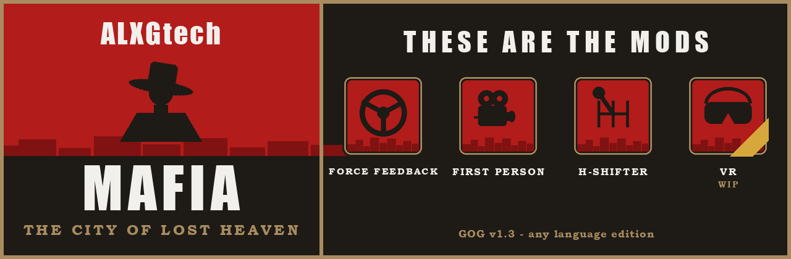
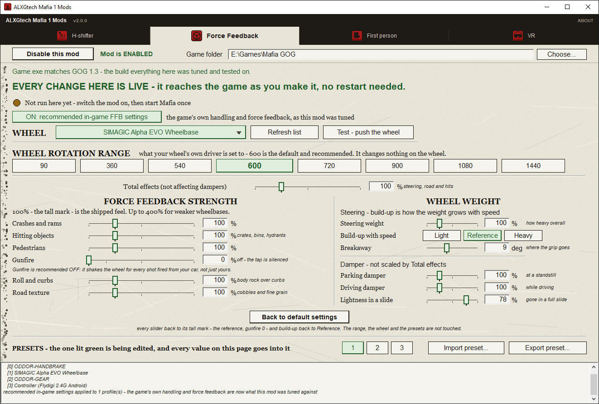
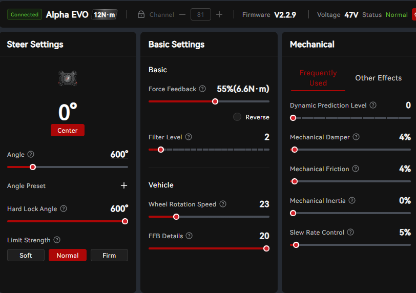
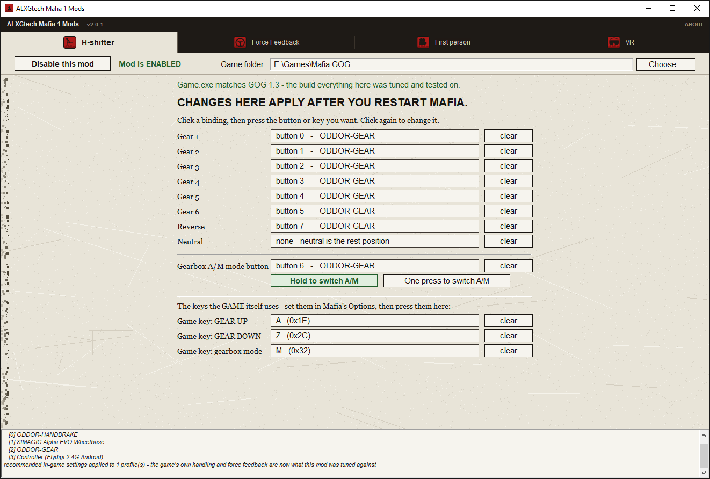
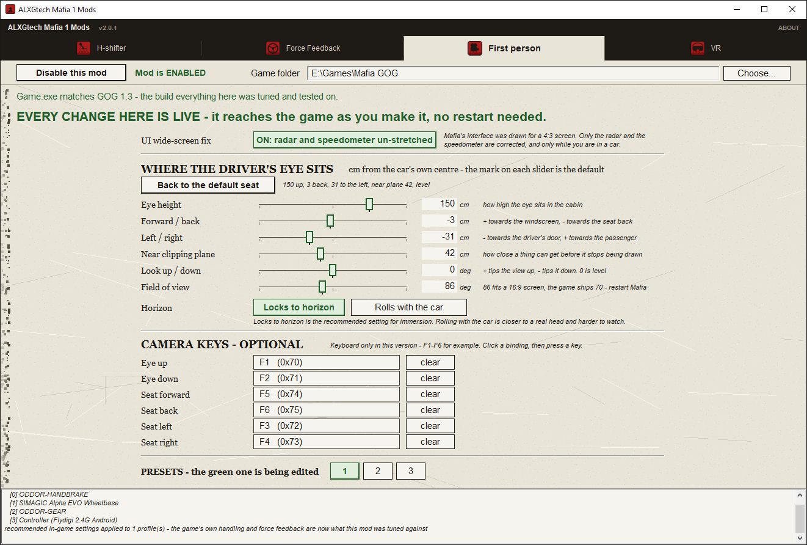

[English](README.md) | [Русский](README.ru.md) | [Čeština](README.cs.md) | Polski

# ALXGtech Mafia 1 Mods

Ten mod daje grze Mafia: The City of Lost Heaven (2002, **GOG v1.3 build 16073**)

* nowoczesne wsparcie kierownicy z siłowym sprzężeniem zwrotnym Direct Drive Force Feedback
  (testowane na Simagic EVO 12nm, większość kierownic powinna działać),
* kamerę z perspektywy pierwszej osoby za kierownicą
* skrzynię biegów H-shifter.

w jednym narzędziu, które je instaluje i usuwa.

Dzięki temu Mafia wreszcie jeździ jak porządna gra symulacyjna!

## 🚀 Szybki start

Trzy mody dla **Mafia: The City of Lost Heaven (2002)** - tej oryginalnej, pierwszej Mafii - w jednym małym programie.

> **Zbudowane i przetestowane dla wydania GOG, v1.3 build 16073 - dowolna wersja językowa.** Wszystkie
> osiem z nich zawiera identyczny `Game.exe`, więc pasuje dowolne. **Twoja wersja ze Steama też może
> działać - nie była testowana, więc spróbuj.** Inne wersje i sklepy nie były testowane. Program
> sprawdza twój `Game.exe` i informuje, jeśli to nie jest kompilacja, dla której to wszystko powstało,
> a wszystko, co instaluje, można cofnąć.

Za długie, żeby czytać? Oto wszystko w skrócie:

1. Pobierz `.zip` z sekcji **[Releases](../../releases)**.
2. Rozpakuj go.
3. Skopiuj `ALXGtech Mafia 1 Mods.exe` do folderu z Mafią, obok `Game.exe`.
4. Uruchom go.
5. Włącz w programie mody, które chcesz, i graj.

**Potem je skonfiguruj - [to zajmie pięć minut](#%EF%B8%8F-konfiguracja-każdego-moda).** Zwłaszcza Force
Feedback - podaj mu zakres obrotu twojej kierownicy.

| | mod | w tym wydaniu |
|:--:|---|---|
| 🎮 | **Force Feedback** - pełny model sił dla kierownicy direct drive | ✅ gotowe |
| 👁️ | **Kamera z perspektywy pierwszej osoby** - miejsce kierowcy i kąt widzenia dopasowany do 16:9 | ✅ gotowe |
| 🕹️ | **H-shifter** - prawdziwa skrzynia typu H steruje własnymi biegami gry | ✅ gotowe |
| 🥽 | **VR** | 🚧 w trakcie prac - jego zakładka jest w oknie, na razie nic nie instaluje |

Wszystko poniżej to szczegóły: co robi każdy mod, co zapisuje w folderze gry i jak to wszystko
cofnąć.

## ✨ Co nowego w wersji 2.0

- **Nowy Force Feedback.** Ciężar kierownicy pochodzi teraz z przednich opon, a nie ze sprężyny
  centrującej: kierownica robi się cięższa wraz z prędkością i staje się lekka, gdy przednie opony
  tracą przyczepność. Faktura nawierzchni, na przykład bruk, ma własny suwak, a siła zderzeń zależy
  od tego, jak szybko uderzasz.
- **Większy zapas** - każdy suwak siły sięga do 400%, dla kierownic słabszych niż baza direct
  drive, na której mod był strojony.
- **Poprawka błędu, przez który skrzynia biegów sama przechodziła w tryb automatyczny.** Nie
  potwierdzono jej jeszcze podczas długiej jazdy w trybie manualnym - jeśli nadal ci się to zdarza,
  otwórz proszę issue.

Aktualizujesz z wersji 1.4.3? Wyłącz mod Force Feedback i włącz go ponownie - raz, przy zamkniętej
Mafii.

## Przed instalacją

- **Zrób kopię zapasową zapisów.** Znajdują się w `<game>\savegame\`. Instalator zapisuje każdy
  plik, który tworzy, i może cofnąć wszystko, ale własna kopia zapasowa to jedyna rzecz,
  którą naprawdę kontrolujesz.
- **Wersja.** Zbudowane dla wydania GOG Mafii v1.3 (build 16073). Wszystkie osiem edycji
  językowych zawiera identyczny `Game.exe`, więc pasuje dowolna; testowane w grze na wersji
  angielskiej. Narzędzie sprawdza twój `Game.exe` i mówi, jeśli to nie jest kompilacja, na
  której wszystko było mierzone. Wersja ze Steama nie była testowana, ale może działać - spróbuj;
  każda inna wersja lub wydanie ze sklepu jest na własne ryzyko.
- **Inne mody.** Zgodność z innymi modami nie była testowana. Dołączony loader ASI wczyta
  również pozostałe twoje mody `.asi` - to zamierzone, ale nieprzetestowane terytorium.
- **Antywirus.** `ALXGtech Mafia 1 Mods.exe` to niepodpisany plik wykonywalny, który zapisuje
  pliki w folderze gry, więc część programów antywirusowych może go oznaczyć. Zweryfikuj
  pobrany plik względem sum kontrolnych SHA-256 opublikowanych wraz z wydaniem.

## Co to jest

Cztery mody w jednym oknie, każdy włączany i wyłączany na własnej zakładce. Trzy z nich działają
już dziś; czwarty uczciwie mówi, że jeszcze nie.

**🎮 Force Feedback.** Kompletny model sił DirectInput8 sterowany na żywo stanem samochodu:
ciężar kierownicy z przednich opon, rosnący wraz z prędkością, tłumik na postoju, odciążenie przy
utracie przyczepności, krawężniki, faktura nawierzchni, kołysanie nadwozia i uderzenia. Zbudowane pod
nowoczesne kierownice direct drive przez ludzi, którzy na nich jeżdżą, bo oryginał nie zachowuje
się tak, jak kierownica powinna się zachowywać w 2026 roku. Gra w wersji oryginalnej po prostu
szarpie kierownicą przy zderzeniu; tutaj zastępuje to pełny model sił. Ustawienia są odczytywane
na bieżąco, więc zmiana na zakładce Force Feedback jest odczuwalna na następnym zakręcie, a nie
dopiero po restarcie.

**👁️ Kamera z perspektywy pierwszej osoby.** Kamera siedzi na miejscu kierowcy, a nie za
samochodem. Poruszanie się pieszo pozostaje bez zmian. Pozycja fotela startuje tam, gdzie została
ustalona za kierownicą, i można nią ruszać klawiszami podczas jazdy; tam, gdzie ją zostawisz, tam
zostaje. Włączenie tego moda dodatkowo poszerza kąt widzenia gry z 70 do 86 stopni, czyli tyle,
ile pasuje do ekranu 16:9 - 70 wygląda najgorzej właśnie z miejsca kierowcy. Kąt ustawia się
suwakiem na tej samej zakładce, a wyłączenie moda przywraca oryginalne bajty.

**🕹️ H-shifter.** Prawdziwa skrzynia typu H steruje własnymi biegami Mafii, więc położenie w
kulisie to i jest wybrany bieg. Mod odczytuje skrzynię przez DirectInput, ukrywa przed grą
przypisane przyciski i po każdej zmianie biegu sprawdza bieg w samej grze, więc nie może zejść z
synchronizacji, a liczba biegów jest ograniczana do rzeczywistej liczby danego samochodu bez
osobnej tabeli dla każdego z nich.

Czwarty mod, **🥽 VR**, jest **🚧 już wkrótce**. Jego zakładka jest w oknie, żeby nikt nie musiał się
zastanawiać, czy o nim zapomniano, i mówi to samo: nieukończony, na razie nic nie instaluje.

## Wymagania

- Windows, 32-bitowy lub 64-bitowy.
- Mafia: The City of Lost Heaven, wydanie GOG, v1.3 build 16073 (`Game.exe`, 2 355 200 bajtów,
  md5 `b500437f340b8a2f1e847e10bb974a06`). Dowolna wersja językowa.
- Force Feedback: kierownica z DirectInput force feedback. Rozwijane i testowane na bazie
  direct drive.
- H-shifter: skrzynia typu H, którą Windows widzi jako kontroler gry.
- Nic więcej. Żadnego AutoHotkey, żadnego vJoy, żadnego kontrolera wirtualnego, żadnego
  środowiska .NET.

## Instalacja

1. Pobierz `.zip` z sekcji [Releases](../../releases) i rozpakuj go.
2. Skopiuj `ALXGtech Mafia 1 Mods.exe` do folderu z Mafią, obok `Game.exe`.
3. Uruchom go. Linia u góry pokazuje, na którym folderze pracuje i jaką kompilację znalazł;
   użyj `Choose...`, jeśli wybrał zły folder.
4. Otwórz zakładkę i naciśnij `Enable this mod`. Przełącznik jest instalacją; nie ma przycisku
   zapisu i nie ma nic więcej do naciśnięcia.
5. Uruchom grę.

Aby usunąć mod, naciśnij `Disable this mod` na jego zakładce. Loader ASI odchodzi wraz z
ostatnim modem, który go potrzebował, a razem z nim znika także własny folder narzędzia.

## ⚙️ Konfiguracja każdego moda

Każda zakładka ma na górze to samo: przełącznik włączenia, twój folder gry i linię mówiącą,
czy znaleziony `Game.exe` to kompilacja, na której wszystko było strojone.

**Uruchom Mafię raz przed rozpoczęciem.** Pozwól jej utworzyć profil i wyjdź. Zależą od tego dwie
rzeczy: narzędzie może zapisać zalecane ustawienia w grze tylko do profilu, który już istnieje,
a gra musi choć raz zobaczyć twoją kierownicę.

### 🎮 Force Feedback

Wszystko na tej zakładce jest **na żywo** - dociera do gry w momencie, gdy przesuwasz suwak, bez
restartu.

1. **Najpierw podłącz kierownicę, potem otwórz zakładkę.** Zakładka wybiera pierwszą znalezioną
   kierownicę z force feedback; jeśli masz ich kilka, wybierz swoją z listy rozwijanej, a jeśli jej
   brakuje, naciśnij **Refresh list**. **Test - push the wheel** daje jej krótkie pchnięcie z
   narzędzia - używaj go przy zamkniętej Mafii.
2. **Własne ustawienia force feedback gry są ustawiane za ciebie.** Włączenie moda zapisuje do
   twojego profilu Mafii wartości, względem których był strojony, a przycisk ma wtedy napis
   `ON: recommended in-game FFB settings`. Naciśnij go, żeby oddać profilowi dokładnie to, co miał.
3. **Ustaw `WHEEL ROTATION RANGE` dokładnie na to, na co ustawiony jest sterownik twojej
   kierownicy.** Na samej kierownicy nic nie zmienia - mówi modowi, co ma jej podawać.
   **600 to wartość domyślna i zalecana**: wszystko było strojone właśnie przy niej.

**Kierownica, z której pochodzą te liczby, dla informacji.** To baza, względem której strojona
była każda wartość na tej stronie: **Simagic Alpha EVO 12 N.m**, pracująca przy **55%, czyli
6.6 N.m**, z zakresem obrotu ustawionym na **600 stopni** - te same 600, o które prosi krok
powyżej - i własne efekty mechaniczne sterownika pozostawione niemal wyłączone, bo tłumienie i
ciężar dodaje sam mod. Nie trzeba tego kopiować i mod tego nigdy nie odczytuje; jest to tutaj po
to, żeby za zdaniem "strojone przy 600 stopniach" stał obraz.

Potem suwaki. **100% - wysokie oznaczenie - to odczucie fabryczne moda**, a każdy suwak siły sięga
do **400%**, dla słabszej bazy. `Total effects (not affecting dampers)` na górze skaluje wszystkie
siły naraz. Lewa kolumna ustala, jak mocny jest każdy efekt; prawa - jak ciężka i jak mocno
tłumiona jest kierownica.

| suwak | co to jest |
|---|---|
| Crashes and rams, Hitting objects, Pedestrians | uderzenia - obiekty to skrzynki, kosze i hydranty |
| Gunfire | zalecane 0 - patrz niżej |
| Roll and curbs | kołysanie nadwozia na krawężnikach |
| Road texture | bruk i drobna ziarnistość |
| Steering weight | jak ciężka jest kierownica |
| Build-up with speed | `Light`, `Reference` lub `Heavy` - jak ciężar rośnie wraz z prędkością |
| Breakaway | gdzie kończy się przyczepność - domyślnie 9 stopni poślizgu |
| Parking damper, Driving damper | kierownica w spoczynku i w ruchu |
| Lightness in a slide | jaka część tłumika znika w pełnym poślizgu - domyślnie 78% |

**Gunfire jest ustawione na 0 celowo.** Efekt uruchamia się przy każdym strzale z twojego samochodu,
nie tylko twoim, a wstrząs, którego sam nie spowodowałeś, odczuwa się jak usterka kierownicy. Na
wydaniu GOG kanał i tak nie ma na co reagować: odczytuje licznik, który tam nigdy się nie rusza, i
to ten sam powód, przez który trafienia pociskami w ogóle nie są odczuwalne.

**Back to default settings** przywraca każdy suwak do jego wysokiego oznaczenia, a Gunfire do 0.
**Presety 1, 2, 3**: edytowany jest ten, który świeci na zielono; `Import preset...` i
`Export preset...` przenoszą je między komputerami.

**Jeśli do kierownicy nic nie dociera, lampka na górze zakładki mówi, dlaczego** - spójrz tam
najpierw:

| lampka mówi | co to znaczy |
|---|---|
| `Driving effects on` i nazwa twojej kierownicy | wszystko działa |
| `Game not running - last seen on` i nazwa twojej kierownicy | z modem wszystko w porządku, po prostu Mafia nie jest otwarta |
| `Not run here yet` | włącz mod i raz uruchom Mafię |
| `No force is reaching the wheel` | coś to blokuje - sprawdź, czy kierownica jest podłączona i wybrana |

Jeśli mod ostatecznie trzyma **inną kierownicę niż wybrana** - bo wybrana była odłączona w chwili
uruchomienia gry - wiersz kierownicy pokazuje `NOT your choice` i podaje nazwę tej, którą mod wziął.

### 🕹️ H-shifter

**To jedyna zakładka, której zmiany wymagają restartu Mafii.** Mówi o tym sama na górze.

1. **Przypisz położenia.** Kliknij przypisanie, a potem przełącz skrzynię na ten bieg. Kliknij
   ponownie, żeby to zmienić. Neutralny zwykle nie wymaga niczego - u większości skrzyń to
   pozycja spoczynkowa.
2. **Przypisz przycisk trybu A/M i wybierz, jak ma się zachowywać.** Pod nim są dwa przyciski:
   - **`Hold to switch A/M`** - dla położenia na samej skrzyni, gdzie przycisk jest wciśnięty
     przez cały czas, gdy jesteś w tej pozycji.
   - **`One press to switch A/M`** - dla osobnego przycisku, który klika i wraca sam.

   **Narzędzie próbuje rozpoznać to za ciebie**: podczas przypisywania sterowania mierzy, jak
   długo pozostaje wciśnięty, i samo wybiera pasujące zachowanie. Sprawdź, czy wybrało dobrze -
   oba warianty działają, a pasuje do tego, co faktycznie robi twoja ręka, tylko jeden.
3. **Trzy klawisze na dole należą do gry, nie do nas.** Najpierw ustaw GEAR UP, GEAR DOWN i tryb
   skrzyni biegów we **własnych Opcjach Mafii**, a potem naciśnij te same klawisze tutaj, żeby
   mod wiedział, na co nasłuchuje gra.
4. **Zrestartuj Mafię.**

Każdy wiersz ma własny przycisk `clear`, jeśli chcesz usunąć przypisanie. **Wiersz przypisany do
urządzenia, które nie jest podłączone, pozostaje przypisany** i mówi o tym wprost, zamiast po
cichu wracać do stanu nieprzypisanego - więc otwarcie zakładki z odłączoną skrzynią nie niszczy
twojej pracy. Po otwarciu zakładka wypisuje też listę wszystkich znalezionych urządzeń, co jest
najszybszą odpowiedzią na pytanie, dlaczego twojej skrzyni nie ma na liście.

### 👁️ Pierwsza osoba

Również na żywo - **z wyjątkiem `Field of view`**, czyli jedynego wiersza na tej stronie, który
łata `Game.exe` i wymaga restartu Mafii. Zakładka mówi o tym przy tym wierszu.

- **`UI wide-screen fix`** usuwa rozciągnięcie radaru i prędkościomierza, które Mafia rysowała
  pod ekran 4:3. Domyślnie włączone; przycisk wyłącza to w trakcie działania gry.
- **Gdzie siedzi oko kierowcy** - wysokość, przód/tył, lewo/prawo, bliska płaszczyzna
  przycinania, spojrzenie w górę/w dół oraz kąt widzenia. Oznaczona wartość na każdym suwaku to
  fotel, z jakim mod jest dostarczany. **Back to the default seat** wraca do niego.
- **`Field of view`** wynosi 86, co pasuje do ekranu 16:9; gra dostarcza 70. Ten parametr łata
  `Game.exe`, a wyłączenie moda zapisuje z powrotem oryginalne bajty.
- **Horyzont**: `Locks to horizon` to zalecane ustawienie i to, z którym jeżdżono.
  `Rolls with the car` jest bliższe prawdziwej głowie i trudniejsze do oglądania.
- **Klawisze do regulacji kamery podczas jazdy** są opcjonalne i w tej wersji działają
  **wyłącznie z klawiatury. Przyciski kierownicy nie są tu obsługiwane.** Sześć klawiszy fotela,
  domyślnie F1-F6, można przypisać ponownie na tej zakładce. Pary bliskiej płaszczyzny `F9 / F10`
  nie da się przypisać - żyją wyłącznie w `mafia_fp.ini`.
- **Presety 1, 2, 3**, tak jak przy Force Feedback: edytowany jest ten, który świeci na zielono.

### Co pojawia się w folderze gry po włączeniu moda

| mod | pliki |
|---|---|
| każdy mod | `dinput8.dll` (Ultimate ASI Loader) |
| Force Feedback | `mafia_ffb.asi` |
| Pierwsza osoba | `mafia_fp.asi`, `mafia_fp.ini` oraz 12 bajtów wewnątrz `Game.exe` (kąt widzenia) |
| H-shifter | `gearbox_hook.asi`, `ALXG mods\gearbox hshifter setup\gearbox.ini` |

Kąt widzenia to jedyna rzecz tutaj, która dotyka `Game.exe`, i są to trzy czterobajtowe floaty,
tej samej długości, nic nie jest przesunięte. `Game.exe.bak` powstaje przed pierwszym zapisem,
oryginalne bajty są zapisywane, a wyłączenie kamery zapisuje je z powrotem. Dane gry nie są
dotykane w ogóle: żadne archiwum `.dta`, żaden `tables\`, żaden `sounds\`, nic
zlokalizowanego.

Wszystko nasze mieści się w jednym folderze, `<game>\ALXG mods\` - dziennik, ustawienia skrzyni
i ustawienia Force Feedback. W głównym folderze gry pozostają tylko trzy pliki `.asi` oraz
loader ASI, ponieważ loader nie czyta żadnego innego folderu.

Każdy zapis jest najpierw odnotowany w `<game>\ALXG mods\install.log`, a to, co zostało przez
niego zastąpione, trafia obok do `original\`. Odinstalowanie działa na podstawie tego zapisu,
linia po linii, więc przywraca dokładnie to, co tam było. Plik, który edytowałeś samodzielnie,
jest rozpoznawany jako twój, mówi się o tym wprost i pozostaje nietknięty.

### Instalacja ręczna

Jeśli wolisz nie uruchamiać narzędzia, `manual-install\` zawiera te same pliki. Skopiuj je do
folderu gry w układzie tam pokazanym. Nie będziesz mieć wtedy ani dziennika, ani odinstalowania;
pliki trzeba usunąć ręcznie, żeby zdjąć mody. Oba pliki `.ini` to ustawienia, więc kopiuj je
tylko wtedy, gdy nie masz jeszcze własnych.

## Użytkowanie

Konfiguracja modów ma [swoją sekcję powyżej](#%EF%B8%8F-konfiguracja-każdego-moda). To jest to, co robisz,
gdy są już skonfigurowane.

Podczas jazdy, przy włączonej kamerze z perspektywy pierwszej osoby, domyślne klawisze to:

| klawisz | co robi |
|---|---|
| F1 / F2 | oko wyżej / niżej, 2 cm za naciśnięcie |
| F3 / F4 | oko w lewo / w prawo |
| F5 / F6 | oko do przodu / do tyłu |
| F9 / F10 | bliska płaszczyzna przycinania dalej / bliżej |

Wyłącznie klawiatura, jak mówi zakładka. Fotel, na którym się ustalisz, jest zapisywany z
powrotem do `mafia_fp.ini`, więc przetrwa ponowne uruchomienie, a te same wartości są widoczne
na zakładce First person. W `mafia_fp.ini` istnieją też inne, nieprzypisane sterowania.

Wszystko na zakładkach Force Feedback i First person działa, gdy gra jest uruchomiona, więc
możesz zostawić narzędzie otwarte obok Mafii i poczuć zmianę na następnym zakręcie. Dwa
wyjątki: `Field of view`, który łata `Game.exe`, oraz cała zakładka H-shifter, której
przypisania są odczytywane przy starcie gry. Obie mówią o tym na ekranie.

## Kompatybilność

| testowano | wynik |
|---|---|
| GOG v1.3 build 16073, angielska | testowane, na tej kompilacji wszystko było mierzone |
| GOG v1.3, rosyjska | zainstalowane i uruchomione na czystej instalacji: `Game.exe` bajtowo identyczny, wszystkie trzy mody się wczytały |
| GOG v1.3, pozostałe sześć języków | identyczny `Game.exe`, więc powinno działać, ale nie testowano w grze |
| Steam i inne wydania | nietestowane - Steam może działać, spróbuj. Program powie, jeśli nie rozpozna kompilacji |
| inne mody | nietestowane |

W folderze gry może żyć tylko jeden `dinput8.dll`. Jeśli masz tam już loader ASI, istniejący
jest zapisywany w kopii zapasowej przed zastąpieniem i przywracany przy odinstalowaniu.

## Znane problemy

- Przy prędkościach wyścigowych kierownica może czasem dostać wstrząs o pełnej sile, jak przy
  zderzeniu - na otwartej prostej, gdzie nie ma w co uderzyć. W tym wydaniu nie jest to naprawione.
- Force Feedback był strojony na bazie direct drive; inne kierownice nie były testowane.
- Uderzenie od tyłu jest ledwo odczuwalne. To zmierzone, a nie zgadnięte: żaden nasz kanał
  jeszcze tego nie wykrywa, a poluzowanie progu uderzenia przywraca fałszywe kopnięcia, które
  były gorsze. To znany błąd i w tym wydaniu nie jest naprawiony.
- Licznik obrażeń w tej kompilacji gry nie daje nic użytecznego, więc trafienia pociskami nie
  są odczuwalne przez kierownicę.
- Klawisze kamery w tej wersji działają wyłącznie z klawiatury. Przycisku kierownicy nie da się
  jeszcze do nich przypisać.
- Suwak kąta widzenia zaczyna działać przy następnym uruchomieniu Mafii, w przeciwieństwie do
  wszystkiego innego na tej zakładce, co dociera do uruchomionej gry w około sekundę.
- Zakładka VR nic nie instaluje - ten mod nie jest ukończony.

## Dla deweloperów

Źródła są otwarte, w tym same mody i instalator - wszystko pod `src\`. Budowane są za pomocą
LLVM-MinGW dla 32-bitowego Windows. **Skrypty budowania nie są jeszcze opublikowane**; wciąż
zawierają ścieżki charakterystyczne dla konkretnej maszyny, a ich uporządkowanie jest na liście
zadań, a nie zrobione. Mody to wtyczki ASI: `LS3DF.dll` gry
importuje `DINPUT8.dll`, Windows odnajduje go w folderze gry, a dołączony Ultimate ASI Loader
wczytuje każdy plik `.asi` obok siebie. Stamtąd każdy mod odczytuje własny stan samochodu
silnika pod znanymi adresami i albo wysyła siły do kierownicy, albo porusza kamerą, albo
steruje biegami.

Pull requesty i forki są mile widziane, w tym przeniesienie tej techniki do innej gry.

## Podziękowania

- [Ultimate ASI Loader](https://github.com/ThirteenAG/Ultimate-ASI-Loader) od ThirteenAG,
  dołączony jako `dinput8.dll`. Zobacz `THIRD-PARTY.md`. To jedyny kod firm trzecich, który jest
  tu dostarczany.
- **[GTAV Manual Transmission](https://github.com/ikt32/GTAVManualTransmission)** od ikt32. **Model
  Force Feedback częściowo korzysta z jego logiki**: ciężar kierownicy wyliczany z kąta poślizgu i
  obciążenia przednich opon, wygaszany, gdy opona buksuje lub się blokuje, bez sprężyny centrującej -
  oraz z części jego wartości domyślnych. Zbudowano go tu od nowa na własnych danych Mafii i nie
  skopiowano żadnego kodu tego projektu.
- Wszystko inne to własna praca tego projektu.

### Inspiracje - obejrzane, przemyślane, niewykorzystane

Dwa poniższe projekty rozwiązywały problemy, które ma też ten mod, a zobaczenie, że da się je
rozwiązać, było warte bardzo dużo. **Żaden ich kod nie znajduje się w tym repozytorium ani w
niczym, co ono dostarcza.** Każdy z nich został przeczytany jako punkt odniesienia dla tego, co
jest możliwe, a implementacja tutaj powstała niezależnie i wyszła inna. Są wymienieni, bo na to
zasługują, a nie dlatego, że coś od nich zostało wzięte.

- **[WidescreenFixesPack - Mafia](https://github.com/ThirteenAG/WidescreenFixesPack/releases/tag/mafia)**
  od ThirteenAG. Punkt odniesienia dla problemu interfejsu na szeroki ekran. Nasza poprawka to
  inne podejście i nie dzieli z nim żadnego kodu.
- **[Mafia First Person Shooter Mod](https://www.moddb.com/mods/first-person-camera/downloads/mafia-first-person-shooter-mod)**.
  Punkt odniesienia na to, że widok pierwszoosobowy w tej grze jest w ogóle osiągalny. Nasz jest
  zrobiony całkowicie inaczej i nie dzieli z nim żadnego kodu.

### Jeśli nie jesteś tu wymieniony, a powinieneś być

**Ta lista jest niemal na pewno niepełna.** Pracę się czyta, uczy się z niej, a lata później
pamięta się ją tylko w połowie, a osoba, która ją wykonała, nigdy o tym nie słyszy. Jeśli coś
twojego powinno się tu znaleźć, a go nie ma - powiedz, a się pojawi.

Ta sama propozycja działa też w drugą stronę wobec każdego, kto jest już wymieniony: linia z
podziękowaniem, sposób opisania techniki, link, samo wspomnienie - powiedz, co chcesz zmienić
albo usunąć, a zostanie to zrobione. W pełni, bez sporu i bez konieczności uzasadniania prośby.

Otwórz tu issue albo skontaktuj się w dowolny najwygodniejszy dla ciebie sposób. Dotyczy to
każdego, czyja praca jest wspomniana choćby pośrednio. Nikt nie powinien musieć uzasadniać, jak
ma być opisana jego własna praca.

## Licencja i informacje prawne

Własny kod tego projektu jest na licencji MIT. Zobacz `LICENSE`.

Ten mod wymaga legalnej kopii gry Mafia: The City of Lost Heaven. Żadne pliki ani zasoby gry
nie są dołączone ani rozpowszechniane.

Ten projekt nie jest powiązany z Take-Two Interactive, 2K ani byłym Illusion Softworks, ani
przez nich nie jest wspierany. Mafia jest znakiem towarowym swoich właścicieli. Licencja MIT
obejmuje wyłącznie własny kod tego projektu; gra i jej zasoby pozostają własnością swoich
właścicieli.
