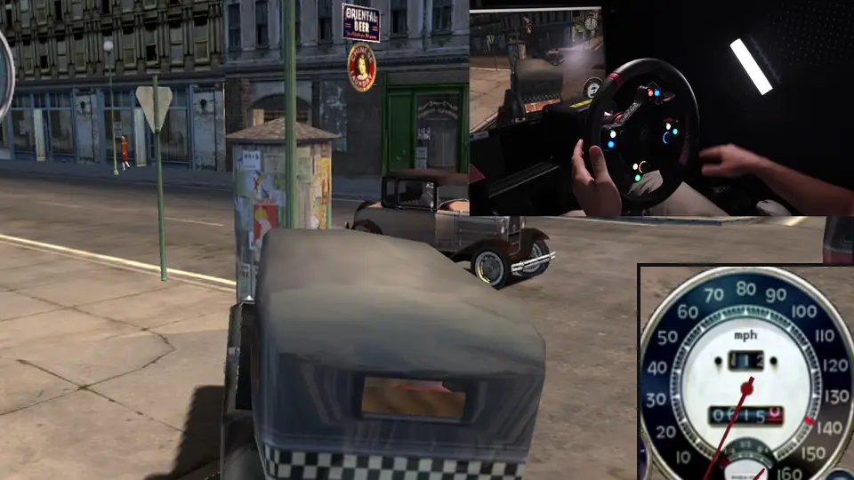
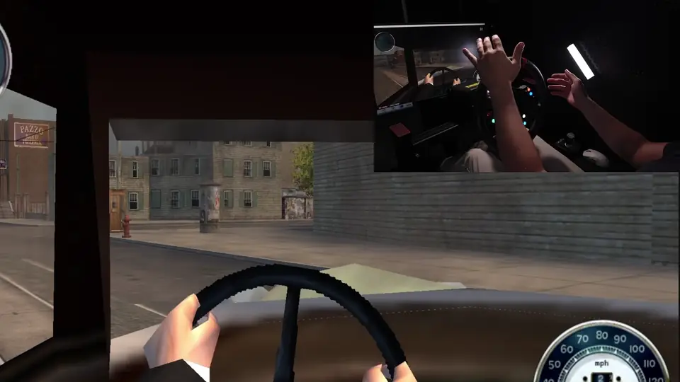
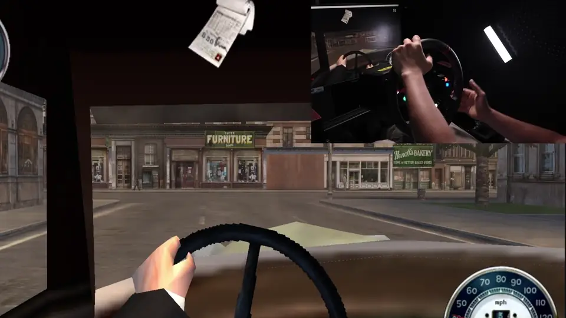
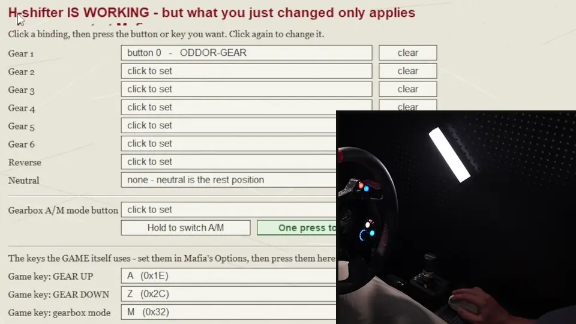

[English](README.md) | Русский | [Čeština](README.cs.md) | [Polski](README.pl.md)

# ALXGtech Mafia 1 Mods

Этот мод даёт Mafia: The City of Lost Heaven (2002, **GOG v1.3 build 16073**)

* современную поддержку руля с силовой обратной связью Direct Drive Force Feedback (проверено на Simagic EVO 12nm, большинство рулей должны подойти),
* камеру от первого лица за рулём
* H-шифтер.

в одной утилите, которая их ставит и убирает.

Так что теперь Mafia наконец-то едет как настоящий симулятор!

## 🚀 Быстрый старт

Три мода для **Mafia: The City of Lost Heaven (2002)** - той самой, первой Mafia - в одной небольшой утилите.

> **Сделано и проверено на GOG-издании, v1.3 build 16073 - подходит любая языковая версия.** Все
> восемь изданий поставляются с одинаковым `Game.exe`, так что подойдёт любое. **Ваша Steam-версия
> тоже может заработать - она не тестировалась, так что попробуйте.** Другие версии и магазины не
> проверялись. Программа проверяет ваш `Game.exe` и сообщает, если это не та сборка, под которую всё
> делалось, а всё, что она ставит, можно откатить.

Некогда читать? Вот и всё:

1. Скачайте `.zip` из раздела **[Releases](../../releases)**.
2. Распакуйте архив.
3. Скопируйте `ALXGtech Mafia 1 Mods.exe` в папку с Mafia, рядом с `Game.exe`.
4. Запустите.
5. Включите нужные моды в самой программе и играйте.

**Потом настройте их - [это займёт пять минут](#%EF%B8%8F-настройка-каждого-мода).** Особенно обратную
связь - укажите ей диапазон поворота своего руля.

| | мод | в этом релизе |
|:--:|---|---|
| 🎮 | **Обратная связь** - полная модель сил для руля с прямым приводом | ✅ готова |
| 👁️ | **Камера от первого лица** - место водителя и угол обзора под 16:9 | ✅ готова |
| 🕹️ | **H-шифтер** - настоящая кулиса управляет собственными передачами игры | ✅ готов |
| 🥽 | **VR** | 🚧 в разработке - вкладка в окне есть, но пока она ничего не ставит |

Дальше идут подробности: что делает каждый мод, что он пишет в папку игры и как всё это убрать
обратно.

## ✨ Что нового в 2.0

- **Новая обратная связь.** Вес руля теперь берётся от передних шин, а не от центрирующей
  пружины: с ростом скорости руль тяжелеет, а когда передние шины теряют сцепление, становится
  лёгким. У фактуры дороги, например брусчатки, теперь свой слайдер, а сила столкновений зависит
  от того, как быстро вы врезались.
- **Больше запаса по силе** - каждый слайдер силы доходит до 400%, для рулей слабее той direct
  drive базы, на которой всё настраивалось.
- **Исправлено самопроизвольное переключение коробки в автомат.** На долгой поездке в ручном режиме
  это пока не подтверждено - если у вас оно всё же случается, откройте, пожалуйста, issue.

Обновляетесь с 1.4.3? Один раз выключите и снова включите мод Force Feedback при закрытой Mafia.

## Прежде чем ставить

- **Сделайте копию сохранений.** Они лежат в `<game>\savegame\`. Установщик записывает каждый
  файл, который меняет, и может откатить всё обратно, но собственная резервная копия - это
  единственное, что по-настоящему в ваших руках.
- **Версия.** Собрано под GOG-издание Mafia v1.3 (build 16073). Все восемь языковых изданий
  содержат одинаковый `Game.exe`, поэтому подойдёт любое; играли и тестировали на английской
  версии. Утилита проверяет ваш `Game.exe` и говорит, если это не та сборка, на которой всё
  измерялось. Steam-версия не проверялась, но может заработать - попробуйте; любая другая версия
  или магазин - на ваш риск.
- **Другие моды.** Совместимость с другими модами не проверялась. Вложенный ASI-загрузчик
  загрузит и остальные ваши `.asi`, это задумано, но не проверено.
- **Антивирус.** `ALXGtech Mafia 1 Mods.exe` - неподписанный исполняемый файл, который пишет в папку
  игры, поэтому антивирус может на него ругаться. Сверьте загрузку с контрольными суммами
  SHA-256, опубликованными вместе с релизом.

## Что это

Четыре мода в одном окне, каждый включается и выключается на своей вкладке. Три работают
уже сегодня; четвёртый честно говорит, что пока нет.

**🎮 Обратная связь.** Полная модель сил DirectInput8, которая считается по актуальному состоянию
машины в реальном времени: вес руля от передних шин, растущий со скоростью, демпфер на стоянке,
облегчение руля при потере сцепления, бордюры, фактура дороги, раскачка кузова и
удары. Сделано для современных direct drive рулей людьми, которые сами на них ездят, - потому что
штатная обратная связь ведёт себя не так, как должен вести себя руль в 2026 году. Стоковая игра
при столкновении просто бьёт по рулю; здесь это заменено полной моделью сил. Настройки
перечитываются на ходу, поэтому изменение на вкладке Force Feedback чувствуется на следующем
повороте, а не после перезапуска.

**👁️ Камера от первого лица.** Камера сидит на месте водителя, а не позади машины. Пешком всё
осталось по-старому. Посадка по умолчанию - там, где её в итоге подобрали за рулём, а во время
езды её можно двигать клавишами; где оставите, там и останется. Включение этого мода заодно
расширяет угол обзора игры с 70 до 86 градусов - ровно то, что нужно экрану 16:9, ведь именно с
места водителя 70 градусов смотрятся хуже всего. Угол задаётся слайдером на той же вкладке, а
выключение мода возвращает исходные байты.

**🕹️ H-шифтер.** Настоящая H-образная кулиса управляет передачами прямо в Mafia, так что положение
в пазе - это и есть включённая передача. Мод читает шифтер через DirectInput, прячет назначенные
кнопки от игры и после каждого переключения сверяется с тем, какая передача включена в самой
игре - поэтому рассинхронизации не бывает, а число передач ограничивается реальным для машины,
без отдельной таблицы на каждую модель.

Четвёртый мод, **🥽 VR**, - **🚧 скоро**. Его вкладка есть в окне, чтобы никто не гадал, не забыли
ли про него, и она говорит то же самое: не готов, пока ничего не ставит.

## Что нужно

- Windows, 32 или 64 бита.
- Mafia: The City of Lost Heaven, издание GOG, v1.3 build 16073 (`Game.exe`, 2 355 200 байт,
  md5 `b500437f340b8a2f1e847e10bb974a06`). Любой язык издания.
- Обратная связь: руль с DirectInput force feedback. Разрабатывалось и проверялось на direct
  drive базе.
- H-шифтер: кулиса, которую Windows видит как игровой контроллер.
- Больше ничего. Ни AutoHotkey, ни vJoy, ни виртуального контроллера, ни .NET.

## Установка

1. Скачайте `.zip` из [Releases](../../releases) и распакуйте его.
2. Скопируйте `ALXGtech Mafia 1 Mods.exe` в папку с Mafia, рядом с `Game.exe`.
3. Запустите. В шапке видно, с какой папкой утилита работает и какую сборку нашла; если папка
   не та, нажмите `Choose...`.
4. Откройте вкладку и нажмите `Enable this mod`. Переключатель и есть установка; кнопки
   сохранения нет, нажимать больше нечего.
5. Запустите игру.

Чтобы снять мод, нажмите `Disable this mod` на его вкладке. ASI-загрузчик уходит вместе с
последним модом, которому он был нужен, а вместе с ним и служебная папка утилиты.

## ⚙️ Настройка каждого мода

Вверху каждой вкладки - одно и то же: переключатель, папка игры и строка о том, та ли сборка
`Game.exe` найдена, на которой всё здесь настраивалось.

**Запустите Mafia один раз перед началом.** Дайте ей создать профиль и выйдите. От этого зависят
две вещи: утилита может записать рекомендуемые внутриигровые настройки только в уже существующий
профиль, и сама игра должна была хотя бы раз увидеть ваш руль.

### 🎮 Обратная связь

Всё на этой вкладке действует **сразу** - изменение доходит до игры, пока вы двигаете слайдер,
перезапуск не нужен.

1. **Сначала подключите руль, потом открывайте вкладку.** Вкладка берёт первый найденный руль с
   обратной связью; если их несколько, выберите свой в выпадающем списке, а если его в списке
   нет - нажмите **Refresh list**. **Test - push the wheel** даёт рулю короткий толчок из самой
   утилиты - запускайте проверку при закрытой Mafia.
2. **Настройки обратной связи самой игры выставляются за вас.** Включение мода записывает в ваш
   профиль Mafia те значения, под которые он настраивался, и после этого кнопка подписана
   `ON: recommended in-game FFB settings`. Нажмите её, чтобы вернуть профилю ровно то, что в нём
   было.
3. **Выставьте `WHEEL ROTATION RANGE` ровно в то, на что настроен драйвер вашего руля.** На самом
   руле эта настройка ничего не меняет - она говорит моду, что подавать. **600 - значение по
   умолчанию и рекомендация**: всё настраивалось на нём.

**Руль, с которого взяты эти числа, для справки.** Это база, под которую настраивалось каждое
значение на этой странице: **Simagic Alpha EVO на 12 N.m**, работающий на **55%, то есть 6.6 N.m**,
с диапазоном поворота **600 градусов** - тот же 600, что просит выставить шаг выше, - и
собственные механические эффекты драйвера, выключенные почти полностью, потому что демпфирование
и вес добавляет сам мод. Копировать это не обязательно, и мод их не читает; это здесь для того,
чтобы за словами «настроено на 600 градусах» стояла картинка.

Дальше слайдеры. **100% - высокая риска - это ощущение, с которым мод поставляется «из коробки»**,
а каждый слайдер силы доходит до **400%** - для более слабой базы руля.
`Total effects (not affecting dampers)` вверху масштабирует сразу все силы. Левая колонка задаёт
силу каждого эффекта, правая - насколько руль тяжёл и насколько демпфирован.

| слайдер | что это |
|---|---|
| Crashes and rams, Hitting objects, Pedestrians | удары; предметы - это ящики, урны и гидранты |
| Gunfire | рекомендуется 0 - см. ниже |
| Roll and curbs | раскачка кузова на бордюрах |
| Road texture | брусчатка и мелкая зернистость |
| Steering weight | насколько тяжёл руль |
| Build-up with speed | `Light`, `Reference` или `Heavy` - как растёт вес со скоростью |
| Breakaway | где уходит сцепление - по умолчанию 9 градусов увода |
| Parking damper, Driving damper | руль на месте и в движении |
| Lightness in a slide | какая часть демпфера уходит в полном заносе - по умолчанию 78% |

**Gunfire выставлен в 0 намеренно.** Эффект срабатывает на каждый выстрел из вашей машины, а не
только на ваш собственный, и толчок, который вы сами не производили, ощущается так, будто руль
сломался. А на релизе GOG эффекту и вовсе не на что реагировать: канал читает счётчик, который там
никогда не двигается, - и это та же причина, по которой попадания по вам никак не ощущаются.

**Back to default settings** возвращает каждый слайдер к высокой риске, а Gunfire - к 0.
**Пресеты 1, 2, 3**: тот, что горит зелёным, редактируется; `Import preset...` и
`Export preset...` переносят их между машинами.

**Если до руля ничего не доходит, индикатор вверху вкладки говорит, почему** - смотрите сначала
на него:

| индикатор говорит | что это значит |
|---|---|
| `Driving effects on` и название вашего руля | всё работает |
| `Game not running - last seen on` и название вашего руля | с модом всё в порядке, просто Mafia не открыта |
| `Not run here yet` | включите мод и один раз запустите Mafia |
| `No force is reaching the wheel` | что-то это блокирует - проверьте, что руль подключён и выбран |

Если мод в итоге держит **не тот руль, который вы выбрали** - потому что выбранный был отключён
в момент запуска игры, - в строке руля написано `NOT your choice` и названо то устройство,
которое он взял.

### 🕹️ H-шифтер

**Это единственная вкладка, изменения на которой требуют перезапуска Mafia.** Она сама об этом
пишет вверху.

1. **Привяжите пазы.** Нажмите на привязку, затем переведите кулису в эту передачу. Нажмите ещё
   раз, чтобы изменить. Нейтраль обычно привязывать не нужно - на большинстве кулис это положение
   покоя.
2. **Привяжите кнопку режима A/M и выберите, как она себя ведёт.** Под ней две кнопки:
   - **`Hold to switch A/M`** - для паза на самой кулисе, где кнопка удерживается всё время, пока
     вы в этом положении.
   - **`One press to switch A/M`** - для отдельной кнопки, которая нажимается и отскакивает.

   **Инструмент пытается определить это сам**: когда вы привязываете кнопку, он засекает, как
   долго она остаётся нажатой, и сам выбирает подходящее поведение. Проверьте, что выбор верный -
   работают оба варианта, а совпадает с тем, что реально делает ваша рука, только один.
3. **Три клавиши внизу - игровые, не наши.** Сначала назначьте GEAR UP, GEAR DOWN и режим коробки
   в **настройках самой Mafia**, а потом нажмите те же клавиши здесь, чтобы мод знал, что слушает
   игра.
4. **Перезапустите Mafia.**

У каждой строки есть своя кнопка `clear`, если нужно снять привязку. **Строка, привязанная к
устройству, которое не подключено, остаётся привязанной** и говорит об этом прямо, а не молча
сбрасывается в непривязанное состояние - так что открытие вкладки с отключённой кулисой не стирает
вашу работу. При открытии вкладка также показывает список всех найденных устройств - это самый
быстрый ответ на вопрос, почему вашей кулисы нет в списке.

### 👁️ Камера от первого лица

Тоже действует сразу - **кроме `Field of view`**: это единственная строка на этой вкладке, которая
правит `Game.exe` и требует перезапуска Mafia. Вкладка говорит об этом прямо в этой строке.

- **`UI wide-screen fix`** убирает растяжение радара и спидометра, которые Mafia рисовала под экран
  4:3. По умолчанию включено; кнопка выключает его прямо во время игры.
- **Где сидит глаз водителя** - высота, вперёд-назад, влево-вправо, ближняя плоскость отсечения,
  наклон вверх-вниз и угол обзора. Отмеченное значение на каждом слайдере - посадка, с которой мод
  поставляется «из коробки». **Back to the default seat** возвращает к ней.
- **`Field of view`** равен 86 и рассчитан на экран 16:9; игра поставляется с 70. Именно этот
  параметр правит `Game.exe`, и выключение мода записывает исходные байты обратно.
- **Горизонт**: `Locks to horizon` - рекомендуемая настройка и та, с которой ездили.
  `Rolls with the car` ближе к тому, как ведёт себя настоящая голова, но на неё тяжелее смотреть.
- **Клавиши подстройки камеры на ходу** опциональны и в этой версии **работают только с
  клавиатуры. Кнопки руля здесь не поддерживаются.** Шесть клавиш посадки, F1-F6 по умолчанию,
  можно переназначить на этой вкладке. Пару ближней плоскости `F9 / F10` нельзя - они живут
  только в `mafia_fp.ini`.
- **Пресеты 1, 2, 3**, как и в обратной связи: редактируется тот, что горит зелёным.

### Что появляется в папке игры

| мод | файлы |
|---|---|
| любой мод | `dinput8.dll` (Ultimate ASI Loader) |
| Обратная связь | `mafia_ffb.asi` |
| Первое лицо | `mafia_fp.asi`, `mafia_fp.ini` и 12 байт внутри `Game.exe` (угол обзора) |
| H-шифтер | `gearbox_hook.asi`, `ALXG mods\gearbox hshifter setup\gearbox.ini` |

Угол обзора - единственное здесь, что трогает `Game.exe`, и это три четырёхбайтовых float,
той же длины, ничего не сдвинуто. `Game.exe.bak` делается до первой записи, исходные байты
сохраняются, и выключение камеры пишет их обратно. Игровые данные не трогаются
вовсе: ни архивы `.dta`, ни `tables\`, ни `sounds\`, ничего локализованного.

Всё наше лежит в одной папке, `<game>\ALXG mods\` - журнал, настройки шифтера и настройки
обратной связи. В корне игры остаются только три файла `.asi` и ASI-загрузчик, потому что
других папок загрузчик не читает.

Каждая запись сначала попадает в журнал `<game>\ALXG mods\install.log`, а то, что она вытеснила,
складывается рядом в `original\`. Удаление идёт по этому журналу, строка за строкой, поэтому
возвращается ровно то, что было. Файл, который вы правили сами, распознаётся как ваш, об этом
говорится вслух, и он остаётся нетронутым.

### Установка вручную

Если запускать утилиту не хочется, те же файлы лежат в `manual-install\`. Скопируйте их в папку
игры в показанной там раскладке. Тогда не будет ни журнала, ни удаления - файлы придётся
убирать руками. Два файла `.ini` - это настройки, копируйте их только если своих ещё нет.

## Как пользоваться

Как настраивать моды - [отдельный раздел выше](#%EF%B8%8F-настройка-каждого-мода). Здесь то, что вы
делаете, когда они уже настроены.

За рулём, при включённой камере от первого лица, клавиши по умолчанию:

| клавиша | что делает |
|---|---|
| F1 / F2 | глаз выше / ниже, 2 см за нажатие |
| F3 / F4 | глаз влево / вправо |
| F5 / F6 | глаз вперёд / назад |
| F9 / F10 | ближняя плоскость отсечения дальше / ближе |

Только клавиатура, как и написано на вкладке. Посадка, на которой вы остановитесь, записывается
обратно в `mafia_fp.ini` и переживает перезапуск, а те же значения есть на вкладке First person.
В `mafia_fp.ini` есть и другие клавиши, ни на что не назначенные.

Всё на вкладках Force Feedback и First person действует, пока игра запущена, - утилиту можно
оставить открытой рядом с Mafia и почувствовать изменение на следующем повороте. Два исключения:
`Field of view`, который правит `Game.exe`, и вся вкладка H-шифтера, чьи привязки читаются при
старте игры. Обе говорят об этом на экране.

## Совместимость

| проверено | результат |
|---|---|
| GOG v1.3 build 16073, английский | проверено, всё измерялось на этой сборке |
| GOG v1.3, русский | поставлено и запущено на свежей установке: `Game.exe` побайтово тот же, все три мода загрузились |
| GOG v1.3, остальные шесть языков | `Game.exe` идентичен, поэтому должно работать, но в игре не проверялось |
| Steam и другие издания | не проверялось - Steam может заработать, попробуйте. Утилита скажет, если не узнала сборку |
| другие моды | не проверялось |

В папке игры может жить только один `dinput8.dll`. Если ASI-загрузчик там уже есть, старый
сохраняется перед заменой и возвращается при удалении.

## Известные проблемы

- На гоночных скоростях руль иногда может получить толчок полной силы, как при аварии, на
  открытой прямой, где не во что врезаться. В этом релизе не исправлено.
- Обратная связь настраивалась на direct drive базе; на других рулях она не проверялась.
- Удар сзади почти не чувствуется. Это не догадка, а измеренный факт: ни один из наших каналов
  его пока не улавливает, а ослабление порога удара возвращает ложные толчки, которые были хуже.
  Это известный баг, и в этом релизе он не исправлен.
- Счётчик повреждений в этой сборке игры не даёт ничего пригодного, поэтому попадания пуль
  через руль не ощущаются.
- Клавиши камеры в этой версии только клавиатурные. Кнопку руля на них пока назначить нельзя.
- Слайдер угла обзора применяется при следующем запуске Mafia, в отличие от всего остального
  на этой вкладке, что доходит до запущенной игры примерно за секунду.
- Вкладка VR ничего не ставит - этот мод не готов.

## Разработчикам

Исходники открыты - и сами моды, и установщик, всё лежит в `src\`. Собирается LLVM-MinGW под
32-битную Windows. **Скрипты сборки пока не опубликованы**: в них ещё остаются пути, привязанные
к конкретной машине, и привести их в порядок - задача из списка, а не сделанное дело.
Моды - это ASI-плагины: `LS3DF.dll` игры импортирует `DINPUT8.dll`,
Windows берёт его из папки игры, и вложенный Ultimate ASI Loader загружает все `.asi` рядом.
Дальше каждый мод читает состояние машины по известным адресам движка и либо пишет силы в
руль, либо двигает камеру, либо управляет передачами.

Pull request-ы и форки приветствуются, в том числе перенос подхода на другую игру.

## Благодарности

- [Ultimate ASI Loader](https://github.com/ThirteenAG/Ultimate-ASI-Loader) от ThirteenAG, вложен
  как `dinput8.dll`. См. `THIRD-PARTY.md`. Это единственный сторонний код, который здесь
  поставляется.
- **[GTAV Manual Transmission](https://github.com/ikt32/GTAVManualTransmission)** от ikt32.
  **Модель обратной связи отчасти использует его логику**: вес руля из угла увода и нагрузки
  передних шин, ослабляемый при пробуксовке или блокировке шины, без центрирующей пружины - и часть
  его значений по умолчанию. Здесь она заново построена на собственных данных Mafia, и ни одна
  строка его кода не копировалась.
- Всё остальное - собственная работа проекта.

### Вдохновение - посмотрели, поучились, но не использовали

Два проекта ниже решали задачи, которые стоят и перед этим модом, а увидеть, что их вообще можно
решить, само по себе стоило многого. **Их кода нет ни в этом репозитории, ни в чём-либо, что он
поставляет.** Каждый из них мы читали, чтобы понять, что вообще возможно, а реализация здесь
делалась независимо и получилась другой. Они названы здесь, потому что заслуживают этого, а не
потому, что у них что-то взято.

- **[WidescreenFixesPack - Mafia](https://github.com/ThirteenAG/WidescreenFixesPack/releases/tag/mafia)**
  от ThirteenAG. Ориентир по задаче широкоэкранного интерфейса. Наше решение - другой подход, и с
  ним не совпадает ни строчки кода.
- **[Mafia First Person Shooter Mod](https://www.moddb.com/mods/first-person-camera/downloads/mafia-first-person-shooter-mod)**.
  Ориентир на то, что вид от первого лица в этой игре вообще достижим. Наш сделан совершенно
  по-другому, и с ним не совпадает ни строчки кода.

### Если вас здесь нет, а должны быть

**Этот список почти наверняка неполон.** Работу читают, на ней учатся и годы спустя помнят лишь
наполовину, а тот, кто её сделал, так об этом и не узнаёт. Если что-то ваше должно быть на этой
странице, а его здесь нет - скажите, и оно появится.

Та же готовность действует и в обратную сторону для тех, кто уже упомянут: строка благодарности,
то, как описана техника, ссылка, само упоминание - скажите, что хотите изменить или убрать, и это
будет сделано. Полностью, без споров и без необходимости обосновывать просьбу.

Откройте issue здесь или свяжитесь любым удобным для вас способом. Это касается любого, чья работа
упомянута хотя бы косвенно. Никому не должно приходиться доказывать что-либо, чтобы описание его
собственной работы звучало так, как он хочет.

## Лицензия и правовая информация

Собственный код проекта под лицензией MIT. См. `LICENSE`.

Мод требует легальной копии Mafia: The City of Lost Heaven. Никакие файлы и ресурсы игры не
включены и не распространяются.

Проект не связан с Take-Two Interactive, 2K или бывшей Illusion Softworks и ими не одобрен.
Mafia - торговая марка своих владельцев. Лицензия MIT покрывает только собственный код проекта;
игра и её ресурсы остаются собственностью их владельцев.
